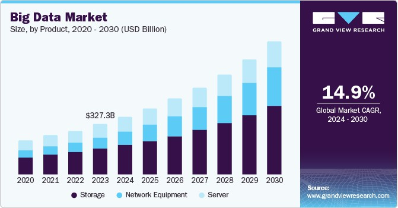
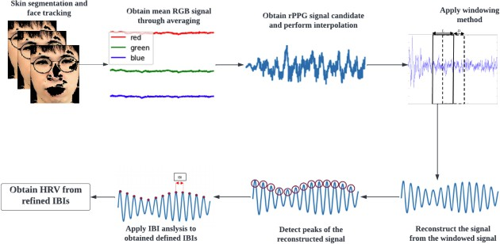
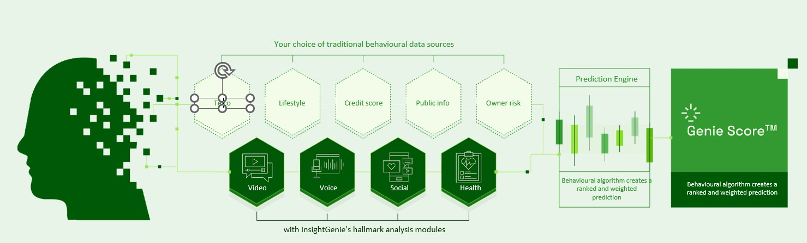
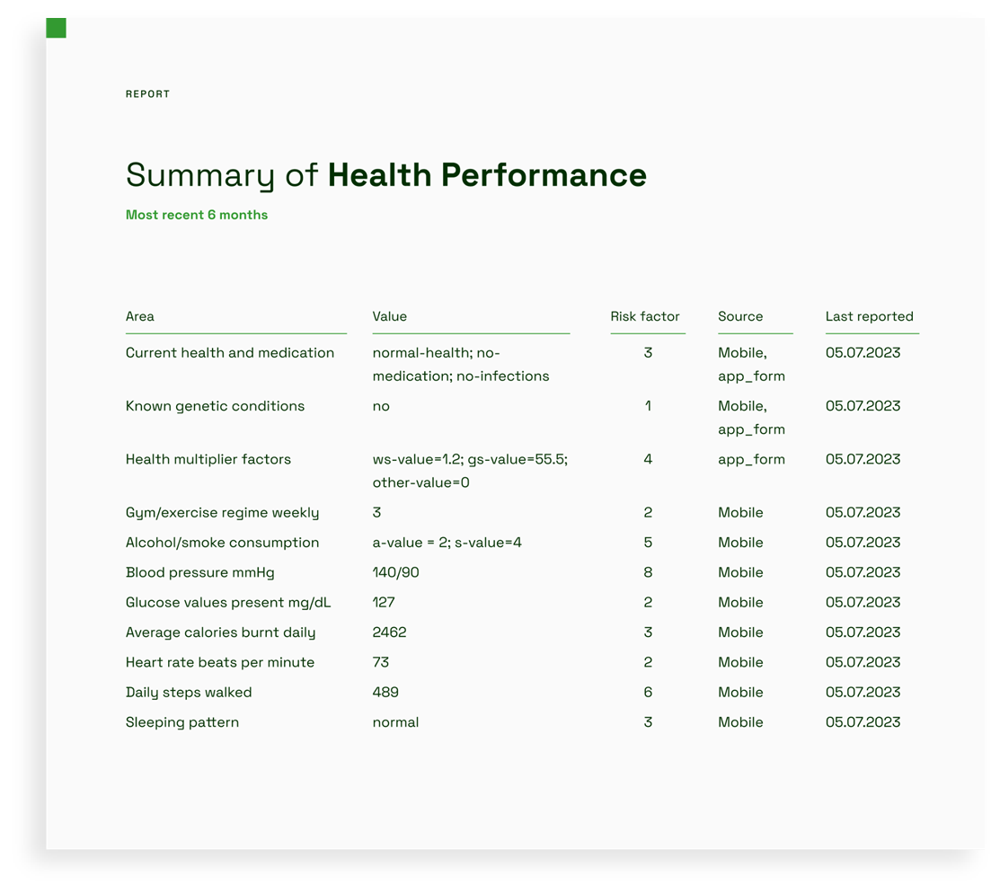
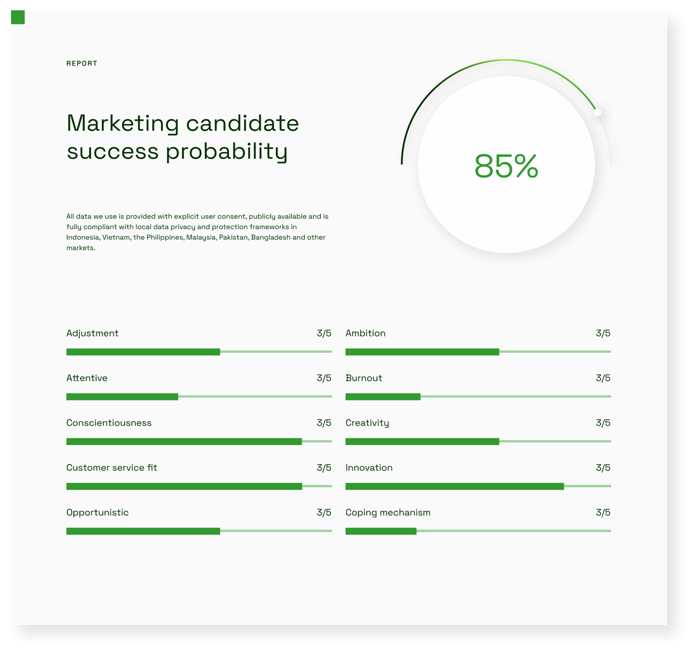
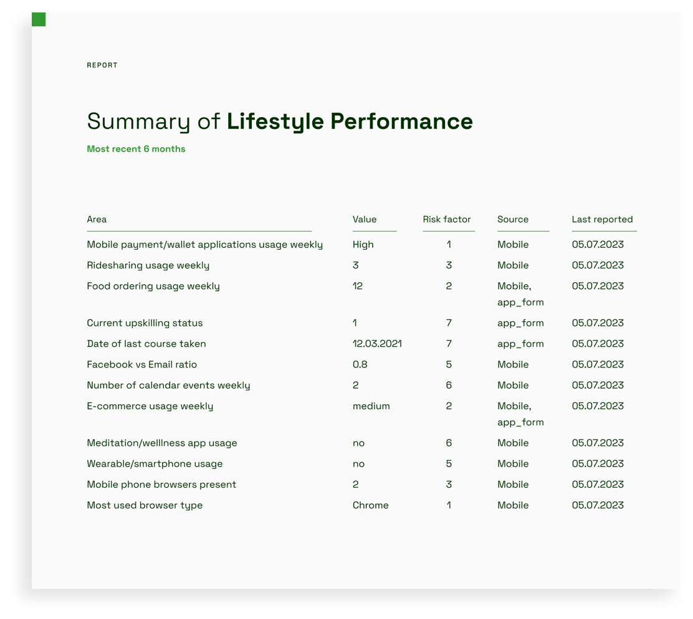
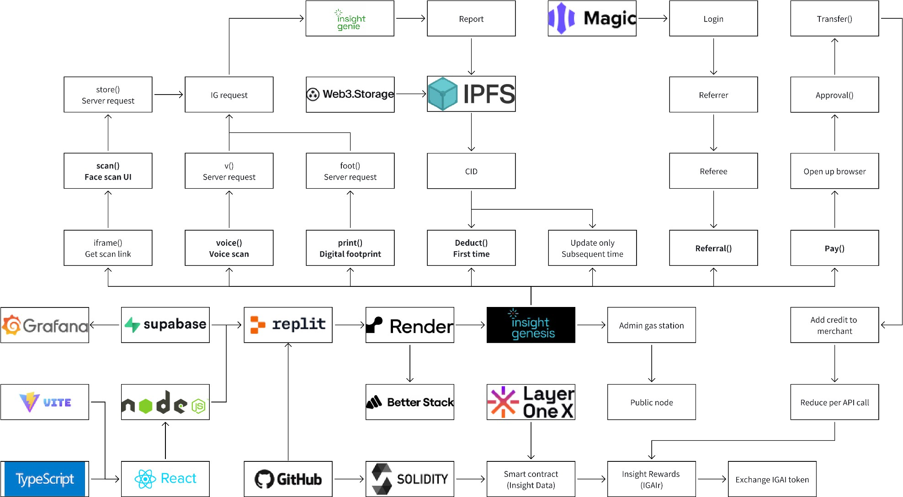
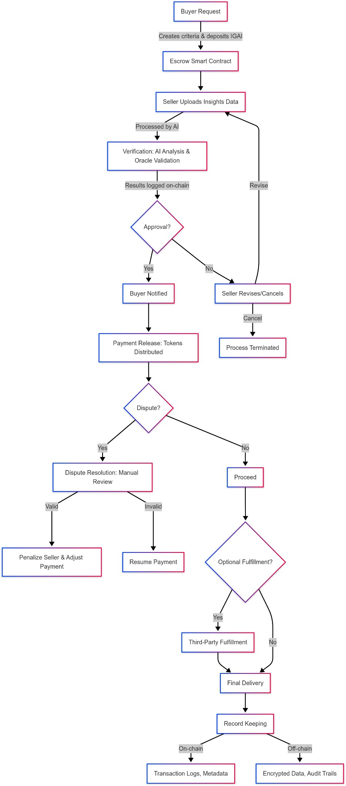

# Insight Genesis WhitePaper

**Own Your Destiny With AI Personal Insights**

Revolutionizing Data Ownership through AI and Web3

_Insight Genesis is a decentralized AI-powered platform enabling individuals to own, monetize, and share data securely, while providing businesses with actionable behavioral insights._

### Executive Summary

Insight Genesis (IGAI) is pioneering a decentralized AI-powered platform that fundamentally transforms data ownership by empowering individuals to securely own, control, and monetize their personal data, while delivering actionable behavioral insights to businesses across multiple sectors.

**What are Personal Insights?** Personal insights are meaningful discoveries about yourself - your health, strengths, habits, or motivations - that help you make better choices and improve your life.

### Vision:

Our vision is a world where enhanced human insights unlock opportunities for more people, enabling organizations to engage confidently with broader populations, including both banked and unbanked communities.

At the core of Insight Genesis lies a decentralized AI data ecosystem that integrates advanced AI technologies—such as remote video and voice analysis—with Web3 principles to create a privacy-first, transparent, and community-driven platform.

This ecosystem leverages Web2 parent company Insight Genie’s proprietary AI engine to perform comprehensive assessments encompassing personality, wellness, career suitability, education, financial behavior, health risk, and psychometric testing, all derived from multimodal acquisition, including video, voice, and digital footprints that AI transforms into behavioral data, aka Decentralized Personal Insights (DPI).

Users retain full ownership and granular control over their data, deciding how it is shared and monetized within the platform. This empowers individuals to earn rewards for contributing their psychometric and behavioral insights, while professionals and organizations gain access to verified, high-quality data that enhances decision-making and research applications.

Our tokenomics model incentivizes active participation and data sharing, ensuring a sustainable, equitable data economy.

Insight Genesis aims to revolutionize traditional customer assessment by harnessing the richness of digital footprints to deliver actionable, personalized insights. This comprehensive profiling enables

organizations to better serve diverse populations, bridging gaps in financial inclusion, human resources, education, and health and wellness sectors.

Through the fusion of AI and blockchain technologies, Insight Genesis offers a secure, scalable, and transparent platform that restores data sovereignty to individuals and fosters a new paradigm of data-driven empowerment.

In summary, Insight Genesis is not merely a platform but a movement toward democratizing data ownership and utilization. By combining cutting-edge AI analytics with decentralized Web3 infrastructure, we are creating an ecosystem where individuals are at the center of innovation, unlocking the true potential of their data to improve lives and drive inclusive growth globally.

### Introduction

### Problem Statement

In today’s digital economy, personal data has become one of the most valuable assets, yet individuals face significant challenges in controlling and benefiting from their own information. The current landscape is characterized by:

* **Limited Data Sovereignty:** Individuals have minimal control over how their personal data is collected, used, and monetized by centralized organizations. This lack of ownership undermines privacy and individual empowerment.
* **Disproportionate Value Capture:** The economic benefits generated from personal data predominantly accrue to large corporations and data aggregators, while the original data creators—the individuals—receive little to no compensation.
* **Privacy and Transparency Deficits:** Existing data collection and usage practices often lack transparency and robust privacy protections, exposing users to risks of unauthorized access, data breaches, and misuse.
* **Verification Challenges:** There is a scarcity of reliable, privacy-preserving mechanisms to verify the authenticity and accuracy of personal data, which limits trust and data utility.
* **Granular Access Control Deficiency:** Individuals lack effective tools to selectively grant or revoke access to specific segments of their data, hindering fine-tuned privacy management.
* **Absence of Fair Compensation Frameworks:** No standardized, transparent systems exist to ensure individuals receive equitable remuneration for the use of their personal data.

These challenges collectively inhibit the realization of a fair, privacy-respecting, and inclusive data economy, particularly affecting underserved populations such as the unbanked and those lacking formal documentation.

### Vision

Insight Genesis (IGAI) envisions a transformative future where individuals regain full ownership and control over their personal data through a blockchain-based decentralized platform. Our solution enables users to tokenize verified personal data points, creating **Verified Data Tokens** that are:

* Authenticated via trusted oracles before tokenization, ensuring data integrity.
* Shared using privacy-preserving technologies such as zero-knowledge proofs, enabling selective and secure disclosure without compromising sensitive information.
* Governed by smart contracts that automate enforcement of usage rights, access permissions, and fair compensation.
* Permanently linked to the original data owner through their unique wallet address reinforcing individual data sovereignty.

This platform supports a wide spectrum of personal data categories, including:

* Demographics and preferences
* Professional credentials and employment history
* Health and wellness metrics
* Consumer behavior and interests
* Skills and educational achievements

By enabling individuals to control and monetize these data assets, Insight Genesis fosters a transparent, equitable, and community-driven ecosystem that bridges the gap between users and organizations requiring high-quality, actionable behavioral insights.

### Focus Use Cases

The tokenization and verified sharing of personal data unlock multiple impactful use cases across key sectors:

* **Financial Services:** Financial institutions can leverage verified behavioral and biometric data to offer personalized, risk-adjusted products such as loans with lower interest rates, credit scoring without traditional credit histories, and tailored financial advice, thereby advancing financial inclusion for unbanked populations.
* **Healthcare:** Medical providers and telemedicine platforms gain access to up-to-date, verified health data, including biometric indicators derived from remote photoplethysmography (rPPG) and prosodic voice analysis, enabling improved diagnostics, personalized treatment plans, and remote health monitoring.
* **Human Resources:** Insight Genesis automates candidate screening and talent management by analyzing psychometric and behavioral data, improving job fit rates by an average of 27%, reducing hiring biases, and enhancing employee engagement through data-driven insights.
* **Education:** Students and educational institutions benefit from personalized guidance based on aptitude and behavioral profiles, helping reduce skill mismatches and optimize career and course selections.

These use cases illustrate how decentralized, AI-powered data ownership can drive better outcomes for individuals and organizations alike, fostering inclusion and efficiency.

### Market Opportunity and Technology Foundation

The global big data market was valued at USD 327.26 billion in 2023 and is projected to grow at a compound annual growth rate (CAGR) of 14.9% through 2030, driven by increasing demand for diverse, verified datasets to enhance decision-making and customer experience.

Insight Genesis integrates cutting-edge AI technologies—such as remote video and voice analysis, photoplethysmography, and prosodic voice analysis—to extract rich, multimodal behavioral insights from digital footprints including video, voice, and social data. This AI engine achieves up to 93% accuracy in the face scan health predictive analytics, validated through FDA Class 2 certified facial scan health predictions and extensive voice sample training (over 500,000 samples).

The platform’s decentralized architecture leverages Ethereum-based blockchain technology, employing:

* **Smart Contracts** for automated, transparent enforcement of data usage and compensation.
* **Transparency and security first**: fully open-source, transparent platform with industry-standard 64-bit encryption, quantum-resistant blockchain cryptography and no personal data storage.
* **Zero-Knowledge Proofs (ZKPs)** and **Key Management Systems (KMS)** to enable privacy-preserving data sharing and selective disclosure.
* **Decentralized Oracle Networks** to verify data authenticity across multiple categories (biometric, financial, educational, identity).

This robust technical foundation ensures security, privacy, and scalability, positioning Insight Genesis as a first-mover in the decentralized AI-powered personal insights marketplace.

### Unique Value Proposition

Insight Genesis stands apart through:

* **User-Centric Data Ownership:** Empowering individuals with full control and monetization rights over their personal data.
* **AI-Powered Behavioral Insights:** Delivering hyper-personalized, actionable insights across health, finance, education, and Human Resources sectors.
* **Privacy-First Design:** Combining open-source transparency, industry-standard 64-bit encryption, quantum-resistant cryptography, and no personal data storage to safeguard user privacy.
* **Tokenized Incentives:** Utilizing the $IGAI utility token to reward data contribution, verification, and usage, fostering active community engagement.
* **Multi-Revenue Streams:** Including AI-driven insights monetization, secure tokenized data transactions, and enterprise API licensing for AI scanning tools and aggregated datasets.
* **Proven Market Fit:** Backed by existing Web2 operations, with $18M+ projected 2025 annual revenue and a $100M valuation, active deployments in five countries (Indonesia, Philippines, Bangladesh, Pakistan, Vietnam) and backed by HSBC, Vynn Capital, Artisan Capital and Orbit Startups.

### Summary

Insight Genesis is not merely a technology platform but a paradigm shift toward democratizing personal data ownership and utilization. By fusing advanced AI analytics with decentralized Web3 infrastructure, we create a secure, transparent, and equitable ecosystem where individuals are the sovereign owners of their data, unlocking new economic opportunities and enabling organizations to make smarter, data-driven decisions with verified, privacy-preserving insights.

This introduction sets the stage for a comprehensive exploration of Insight Genesis’s architecture, tokenomics, governance, and roadmap, illustrating our commitment to building a sustainable, inclusive, and innovative data economy.

### Platform Overview

Insight Genesis is built around a core concept we call **Decentralized Personal Insights (DPI)**—a secure, AI-powered, blockchain-enabled framework that empowers individuals to own, control, and monetize their unique personal data insights while enabling businesses and organizations to access high-quality, verified behavioral and biometric data in a privacy-preserving manner.

### Decentralized Personal Insights (DPI)

* Each user generates a **Digital Personal Insight Profile**, represented by a non-transferable **token linked to their individual wallet** which encapsulates anonymized psychometric scores, health risk indicators, and behavioral assessments derived from AI analysis of voice, video, and digital footprints.
* This DPI is continuously updated through periodic AI-driven assessments, ensuring freshness and relevance of insights.
* The platform’s AI engine leverages multimodal data sources—such as remote photoplethysmography (rPPG) for heart rate variability, prosodic voice analysis for psychological states, and behavioral digital footprints—to create comprehensive, actionable profiles.
* Verified data points within the DPI are tokenized as **Wallet-Bound tokens**, which represent rights to access specific authenticated data segments. These tokens:
  * Are only transferable with explicit user consent.
  * Enable granular privacy controls, allowing users to selectively share insights.
  * Generate compensation for the data owner when accessed.
* Users maintain full sovereignty over their DPI, with smart contracts enforcing usage rights, access permissions, and automated compensation distribution.

### AI and Data Analytics

Insight Genesis integrates advanced AI and data analytics to transform raw data into meaningful insights:

* **Psychometric and Behavioral Analysis:** Using AI models trained on extensive datasets (including over 500,000 voice samples), the platform delivers up to 93% accuracy in predicting health risks in addition to personality traits, job fit and financial behavior.
* **Remote Physiological Monitoring:** Through camera-based rPPG, the system non-invasively measures vital signs such as heart rate variability, stress levels, and cognitive load, validated against clinical standards.
* **Prosodic Voice Analysis:** Analyzes speech patterns—pitch, tone, rhythm—to infer emotional states, mental health conditions, and personality traits, providing novel dimensions of insight beyond traditional data.
* **Digital Footprint Integration:** Behavioral patterns extracted from app usage, social media activity, and device interactions enrich the DPI, enabling holistic profiling.

### Platform Architecture and Workflow

The Insight Genesis platform architecture consists of interconnected layers designed to ensure security, privacy, and seamless data flow:

* **Frontend Interfaces:** Separate portals for users (data owners) to manage their DPI, set sharing permissions, and track rewards; and for businesses to request access to anonymized insights based on predefined criteria.
* **Backend Services:** Robust data processing pipelines handle AI analysis, data verification, and report generation. A staking mechanism ensures data quality by requiring data providers and verifiers to commit tokens as collateral.
* **Blockchain Layer:** Ethereum-based smart contracts manage identity, data ownership (via WBTs), access rights, and payments. Zero-knowledge proofs and encryption protocols guarantee privacy-preserving data sharing.
* **Oracle Network:** Specialized decentralized oracles verify data authenticity across categories such as biometric, financial, educational, and identity data, ensuring trustworthiness without central intermediaries.
* **Security and Privacy:** Multi-layer encryption, quantum-resistant cryptography, and key management systems protect data at rest and in transit. No personal data is stored off-chain in identifiable form.

### Data Transaction Flow

The data access and monetization process follow a transparent, user-centric flow:

1. **Data Generation and Verification:** Users get scanned based on video, voice or behavioral logs which are analyzed by AI and verified by oracle nodes.
2. **Tokenization:** Verified data points are minted as Data Access Tokens (IGAI), linked to the user’s wallet-bound Token representing their DPI.
3. **Access Requests:** Businesses submit data access requests specifying required data types and verification levels.
4. **Consent and Access Control:** Users receive notifications and can grant or deny access to specific insights with time-bound permissions.
5. **Compensation:** Upon access approval, smart contracts automatically distribute payments to data owners and verifiers, with transparent fee breakdowns.
6. **Dispute Resolution:** In case of mismatches or quality issues, a dispute mechanism involving platform administrators and oracle consensus ensures fairness, with penalties applied to low-quality data providers.
7. **Data Update and Renewal:** Users are incentivized to keep their DPI updated through periodic AI assessments, maintaining data freshness and maximizing value.

### Use Cases Enabled by DPI

The DPI framework supports a broad range of applications:

* **Financial Inclusion:** Enables lenders to assess creditworthiness using verified behavioral and biometric insights, expanding access to financial products for unbanked populations.
* **Healthcare:** Provides clinicians with up-to-date, validated health metrics for remote monitoring and personalized care.
* **Human Resources:** Automates candidate screening and employee development by leveraging psychometric and behavioral data.
* **Education:** Offers personalized learning and career guidance based on aptitude and interest profiling.

### Artificial Intelligence Technology: The Core of Decentralized Personal Insights (DPI)

Insight Genesis’s platform is powered by a sophisticated AI engine that transforms multimodal personal data into actionable, privacy-preserving Decentralized Personal Insights (DPI). This section details the scientific foundations, technology components, and real-world validation of our AI capabilities, which enable users to generate verified, tokenized insights that they fully own and control.

### Evolution and Impact of Artificial Intelligence

Artificial Intelligence (AI) has undergone a remarkable transformation since its inception in the 1970s, evolving from narrow rule-based systems to complex neural networks capable of natural language understanding, image recognition, and predictive analytics. Today, AI is a critical enabler of democratized access to essential services, particularly for underserved populations.

* **Financial Inclusion:** AI-powered fintech solutions use alternative data—such as mobile phone usage and utility payments—to assess creditworthiness for unbanked individuals, enabling microloans and mobile banking services.
* **Healthcare:** AI diagnostic tools analyze medical images with high accuracy and support telemedicine platforms that extend expert care to remote areas. Personalized medicine benefits from AI’s ability to analyze individual patient data for tailored treatment plans.
* **Human Resources:** AI streamlines recruitment by matching candidates to roles based on skills and potential, reducing bias and improving diversity. Predictive analytics enhance employee retention and development.

Insight Genesis leverages this AI revolution by integrating it with decentralized Web3 infrastructure to empower individuals with ownership and monetization of their personal insights.

### Photoplethysmography (PPG) and Remote Physiological Monitoring

Photoplethysmography (PPG) is an optical technique that measures vital signs by detecting blood volume changes in peripheral blood vessels. Recent advances in **remote photoplethysmography (rPPG)** enable non-contact measurement of physiological signals using standard RGB cameras and ambient light, offering a scalable, non-invasive alternative to traditional sensors.

### Scientific Principles

* rPPG detects subtle variations in reflected light caused by blood flow beneath the skin.
* Key metrics extracted include:
  * **Heart Rate Variability (HRV):** Reflects autonomic nervous system balance and stress levels.
  * **Standard Deviation of Normal Intervals (SDNN):** Measures overall HRV.
  * **Root Mean Square of Successive Differences (RMSSD):** Sensitive to parasympathetic activity.
  * **LF/HF Ratio:** Indicates sympathetic-parasympathetic balance.
  * **Baevsky Stress Index:** Specialized metric quantifying stress.

### Validation Study

A comprehensive study involving 14 adults (ages 18–33) was conducted using a Logitech Brio camera under ambient lighting to compare rPPG measurements against a contact-based pulse oximeter.

* Protocol included rest periods and stress-inducing Stroop tests (with and without audio feedback).
* Results demonstrated:
  * **SDNN:** Mean absolute error of 4.89 ms; correlation coefficient 0.9.
  * **Baevsky Stress Index:** Correlation coefficient 0.85.
* Performance remained consistent across stress conditions, with best accuracy during silent Stroop tests.

### Practical Implications

* Ordinary webcams combined with advanced algorithms can non-invasively monitor stress and cardiovascular health.
* Applications include remote healthcare monitoring, workplace wellness programs, and stress management tools.
* This technology forms a critical component of DPI’s biometric data layer, enabling verified health insights without intrusive devices.

### Multimodal Data Integration and Behavioral Analytics

Insight Genesis’s AI engine integrates multiple data modalities to create comprehensive personal profiles:

* **Video and Facial Analysis:** Detects health markers such as stress, fatigue, and obesity risk.
* **Voice Analysis:** Extracts emotional states, stress levels, and psychological traits.
* **Digital Footprints:** Behavioral patterns from app usage, social media, and device interactions.
* **Psychometric Modeling:** Uses machine learning on large datasets (500,000+ voice samples) to predict personality, job fit, financial behavior, and health risk with up to 93% accuracy.

These combined data sources enable DPI to provide hyper-personalized, actionable insights across finance, health, education, and human resources.

### Prosodic Voice Analysis: Unlocking Psychological Insights

Prosodic voice analysis examines non-verbal speech characteristics—such as pitch, tone, rhythm, loudness, and speaking rate—to infer psychological and emotional states.

### Scientific Foundations

* Extroversion correlates with higher pitch and energetic speech.
* Introversion manifests as monotonic, measured speech.
* Depression is characterized by lower pitch, reduced energy, and frequent pauses.
* Manic states show rapid speech and pitch variability.
* Autism spectrum and ADHD exhibit unique prosodic patterns, enabling early detection and support.

### Applications

* Clinical mental health diagnostics supplement traditional assessments.
* Recruitment processes use voice-based personality profiling to improve candidate matching.
* Real-time stress and emotional monitoring via wearable devices and adaptive interfaces.

Prosodic analysis is a key pillar of DPI’s behavioral insights, providing rich, validated data points that enhance decision-making for businesses and empower users.

### Integration of AI and Web3: Creating Decentralized Personal Insights (DPI)

The fusion of AI with blockchain technology enables DPI to be:

* **Secure:** Data encrypted with industry-standard 64-bit and quantum-resistant cryptography.
* **Private:** No personal data stored centrally; zero-knowledge proofs and selective disclosure protect user privacy.
* **Transparent:** Open-source platform with verifiable data provenance.
* **User-Centric:** Individuals own their DPI profiles as Wallet-Bound Tokens (WBTs), controlling access and monetization.
* **Incentivized:** Token economy rewards users for contributing and updating data.

This integration transforms raw multimodal data into tokenized, verified insights that users can share selectively with businesses, researchers, and service providers.

### Live Deployments and Market Validation

Insight Genesis’s AI and DPI technologies are operational in multiple countries (Indonesia, Philippines, Bangladesh, Pakistan, Vietnam), through the parent company Insight Genie with:

* Predicted $18 million USD 2025 annual revenue from existing Web2 operations.
* Enterprise pilots with financial institutions and telemedicine providers.
* AI models trained on extensive datasets, achieving 93% accuracy in face scan health predictions (US FDA Class 2 certified).
* Pre-built voice modules used for fraud detection, job suitability, and repayment intent modeling.

### Sample Insight Reports

Insight Genesis generates detailed, actionable reports that include:

* **Health Performance:** Metrics such as blood pressure, glucose levels, heart rate, sleep patterns, and exercise regimes.

* **Behavioral Profiles:** Psychometric scores on attention, conscientiousness, ambition, burnout, creativity, and coping mechanisms.

* **Lifestyle Data:** Usage of mobile payments, ridesharing, food ordering, upskilling status, and social media behavior.

These reports are updated regularly and tokenized within DPI, enabling users to monetize fresh, high-quality data.

### Summary

Insight Genesis’s AI technology stack—anchored by photoplethysmography, prosodic voice analysis, and behavioral data integration—forms the scientific and technical foundation of Decentralized Personal Insights (DPI). By combining validated biometric and psychological measurements with blockchain-enabled data ownership, DPI empowers individuals with unprecedented control, privacy, and monetization opportunities over their personal insights.

This comprehensive AI framework enables businesses across finance, healthcare, education, and human resources to access verified, actionable data, driving smarter decisions and inclusive growth.

### Technical Architecture of the Insight Genesis Platform

Insight Genesis is engineered as a decentralized, AI-powered data platform that enables secure, privacy-preserving ownership, sharing, and monetization of personal data through **Decentralized Personal Insights (DPI)**. The platform’s technical architecture is designed to balance scalability, security, privacy, and user sovereignty, leveraging blockchain, advanced AI, and cryptographic innovations.

### System Architecture Overview

The Insight Genesis platform consists of multiple interconnected layers, each responsible for specific functions that collectively enable DPI creation, management, and utilization.

| **Layer**               | **Description**                                                                                                                                      |
| ----------------------- | ---------------------------------------------------------------------------------------------------------------------------------------------------- |
| **Frontend & UX**       | User portals (web and mobile) for DPI management, data sharing permissions, incentive tracking; Business interfaces for data requests and analytics. |
| **Data Acquisition**    | Collection of multimodal raw data (video, voice, behavioral logs) through secure client apps and APIs.                                               |
| **AI & Data Analytics** | Sophisticated AI engine performing biometric, behavioral, and psychometric analysis to generate DPI profiles.                                        |
| **Data Management**     | Off-chain storage of encrypted metadata and reports; on-chain storage of access control, token balances, and verification records.                   |
| **Blockchain Layer**    | Ethereum-based smart contracts manage data ownership, access rights (IGAI tokens), payments, and governance.                                         |
| **Oracle Network**      | Decentralized oracles verifying data authenticity and quality across biometric, financial, educational, and identity categories.                     |
| **Privacy Layer**       | Implements zero-knowledge proofs, encryption, key management, and selective disclosure to ensure privacy-preserving data sharing.                    |
| **Security Layer**      | Multi-layered security including encryption, smart contract audits, network protection, and anomaly detection.                                       |
| **Scalability Layer**   | Layer 2 solutions such as optimistic rollups and zk-rollups to enhance throughput while preserving decentralization.                                 |

<figure><figcaption></figcaption></figure>

### Frontend and User Experience

Insight Genesis provides distinct portals tailored to different user roles:

* **Data Owners:** Manage their DPI profiles, control data sharing permissions, monitor rewards, and update personal data through intuitive web and mobile applications.
* **Data Consumers (Businesses, Researchers):** Submit detailed data requests specifying required data types, formats, and verification levels; track request status and access purchased insights.
* **Administrators:** Oversee platform operations, including dispute resolution, quality control, and network health monitoring via a comprehensive dashboard.

The user interfaces emphasize ease of use, transparency, and control, ensuring users can confidently manage their data sovereignty.

### Backend Infrastructure and Workflow

The backend consists of two core services:

* **Data Processing Integration Service:** Connects with AI engines and oracle networks to verify, analyze, and enrich raw data into verified DPI profiles.
* **Transaction Management Service:** Handles payment flows, escrow functions, token distributions, and enforcement of smart contract rules.

These services interact with blockchain smart contracts and off-chain databases to maintain data integrity, privacy, and operational efficiency.

### Data Transaction Flow

The data transaction process follows a secure, user-centric workflow:

1. **Buyer Request:** Data consumers create data requests with explicit criteria and deposit IGAI tokens into escrow smart contracts.
2. **Seller Upload:** Data owners upload insights data, which is processed by AI and verified by oracles.
3. **Verification:** AI generates reports; oracles validate data authenticity. Verification results are logged on-chain.
4. **Approval:** If data meets buyer criteria, the buyer is notified; otherwise, the seller can revise or cancel.
5. **Payment Release:** Upon acceptance, escrowed tokens are released to the seller and platform fees are deducted.
6. **Dispute Resolution:** In case of disputes, payments are frozen and manually reviewed by administrators; penalties apply for substandard data.
7. **Fulfillment (Optional):** Additional data processing by third-party fulfillers may be requested before final delivery.
8. **Record Keeping:** All transactions and metadata are securely stored on-chain and off-chain for transparency and auditability

### Core Protocol Layers

Insight Genesis employs a modular, layered protocol stack:

* **Application Layer:** User interfaces, APIs, SDKs enabling interaction with the platform.
* **Service Layer:** Manages data verification, access control, token management, and oracle coordination.
* **Core Layer:** Smart contracts implementing protocol logic, privacy protocols, and consensus mechanisms.
* **Base Layer:** Ethereum blockchain providing security, consensus, and IPFS for decentralized storage.

This separation of concerns facilitates maintainability, upgrades, and scalability.

### Smart Contract Architecture

Smart contracts form the programmable backbone, enforcing:

* **Data Ownership:** Wallet-bound Tokens represent verified personal data points, permanently linked to users.
* **Access Control:** Data Access Tokens (IGAI) grant permissioned access to specific DPI segments.
* **Payment Handling:** Escrow contracts automate deposits, releases, and fee deductions.
* **Verification Logging:** Contracts record oracle verification results and dispute outcomes.

Contracts are optimized for gas efficiency and undergo formal verification and audits to ensure security.

### Data Privacy Architecture

Insight Genesis implements a comprehensive privacy framework:

* **Encryption:** Data encrypted at rest and in transit using industry-standard 64-bit and quantum-resistant algorithms.
* **Zero-Knowledge Proofs (ZKPs):** Enable selective disclosure and verification of data without revealing raw information or personal identifiable information.
* **Key Management Systems (KMS):** Securely manage cryptographic keys with multi-factor authentication.
* **Access Control:** Granular, time-bound, and purpose-specific permissions enforced by smart contracts.
* **No Centralized Storage:** Raw personal data never stored on centralized servers; only encrypted metadata and proofs reside off-chain.

### Data Storage Model

A hybrid on-chain/off-chain storage model balances privacy and efficiency:

* **On-Chain:** Stores immutable access control rules, token balances, verification records, and transaction logs.
* **On-Chain (IPFS):** Holds encrypted user metadata, AI-generated reports, and proof data.
* **Off-Chain (Relational Database):** To bridge the user’s wallet address to the CID in IPFS as a totally anonymous approach and safeguarding the user’s data.

This approach reduces blockchain bloat while maintaining verifiability and data availability.

### Oracle Network Architecture

The decentralized oracle network bridges off-chain data sources and on-chain protocols:

### Oracle Types:

* _Primary Oracles:_ Full verification capabilities across all data categories; higher stake requirements.
* _Specialized Oracles:_ Focused on specific data types (e.g., education, finance, identity) with domain expertise.

### Infrastructure:

* Redundant, geographically distributed nodes ensure high availability.
* Load balancing and fault tolerance mechanisms maintain performance.

### Consensus Mechanism:

* Stake-weighted voting ensures data accuracy.
* Multi-oracle consensus required for critical data.
* Dispute resolution protocols address conflicts.

### Privacy Protocols:

* Temporary, encrypted data access with strict logging.
* Use of zero-knowledge proofs to verify data without exposure.

### Oracle Economic Model

Oracles participate under a robust economic framework:

### Stake Requirements:

* Primary Oracles: Base stake 100,000 IGAI + performance bond + category-specific stakes.
* Specialized Oracles: Lower base stakes aligned with scope.

### Incentives:

* Revenue sharing proportional to stake and performance.
* Penalties for errors or malicious behavior via stake slashing.

### Governance:

* Weighted voting rights based on stake and contributions.
* Limits on maximum voting power to prevent centralization.

### Security Architecture

Security is ensured through multi-layered defenses:

* **Smart Contract Audits:** Formal verification and ongoing bug bounty programs.
* **Network Security:** Node authentication, encrypted communications, DDoS protection.
* **Data Security:** Strong encryption, access controls, audit logging.
* **Attack Prevention:** Rate limiting, anomaly detection, stake slashing, manual review, and system recovery protocols.

### Scalability Solutions

To support growth, Insight Genesis integrates Layer 2 scaling:

* **State Channels:** Enable off-chain transaction batching and rapid interaction.
* **Optimistic Rollups:** Increase throughput while maintaining security guarantees.
* **Zero-Knowledge Rollups:** Provide privacy-preserving scalability.
* **Cross-Chain Interoperability:** Planned support for multiple blockchains to enhance resilience and accessibility.

### API and SDK Architecture

The platform offers secure, developer-friendly interfaces:

* **RESTful APIs:** Provide endpoints for data submission, verification, token management, and oracle interaction.
* **SDKs:** Abstract complex protocol interactions, supporting multiple programming languages with comprehensive error handling and security features.

### Governance and Upgradeability

Governance is decentralized and multi-stakeholder:

* **Token-Based Voting:** $IGAI and WBT holders participate in platform decisions.
* **Upgrade Mechanisms:** Smart contracts designed for modular upgrades with community approval.
* **Dispute Resolution:** Transparent processes involving oracles, administrators, and community input.

### Summary

Insight Genesis’s technical architecture embodies a state-of-the-art decentralized AI data platform that:

* Empowers users with sovereign, privacy-preserving control over their Decentralized Personal Insights (DPI).
* Delivers verified, actionable data to enterprises across sectors.
* Ensures security, transparency, and scalability via blockchain, cryptography, and Layer 2 solutions.
* Incentivizes high-quality data verification through a robust oracle network and economic model.

This architecture establishes the foundation for a sustainable, equitable personal data economy.

### Token Economics and Data Ownership Framework

### Token Types and Roles

Insight Genesis employs a dual-token model designed to facilitate secure data access, incentivize participation, and maintain a sustainable data economy:

### IGAI Token (Data Access Token):

The primary utility token of the platform, IGAI, is required for all data access transactions. It is used by data consumers (businesses, researchers) to purchase permissioned access to verified personal insights within DPI profiles. IGAI tokens represent full data access rights and are non-fractional. The total supply is fixed at 50 billion tokens.

### Wallet-bound Tokens (WBT - Data Ownership Tokens):

Each verified personal data point within a user’s DPI profile is represented by a Wallet-bound Token. Unlike traditional NFTs, these tokens are permanently bound to the owner’s wallet address and are **non-transferable**, ensuring that ownership and control remain with the original data contributor. WBTs confer governance rights over the associated data and enable granular control over data sharing and monetization.

### Wallet-bound Token (WBT) Characteristics

* **Non-transferability:** WBTs cannot be sold, gifted, or transferred to other wallets, preventing unauthorized data ownership changes.
* **Wallet Binding:** Each WBT is cryptographically linked to a specific wallet address, establishing a persistent and verifiable data ownership record.
* **Governance Rights:** WBT holders participate in governance decisions related to data sharing policies, platform upgrades, and verification standards.
* **Granular Control:** WBTs enable users to selectively grant, revoke, or time-limit access to individual data points within their DPI.

### Data Tokenization and Access Workflow

1. **Data Verification:**

Personal data submitted by users undergoes verification by decentralized oracles to ensure authenticity and quality.

### Wallet-bound Token Minting:

Upon successful verification, a Wallet-bound Token is minted and assigned to the user’s wallet, representing ownership of that verified data point within the DPI.

### Data Access Requests:

Data consumers submit requests specifying required data types and verification levels, paying IGAI tokens into escrow smart contracts.

### User Consent and Access Granting:

Users receive access requests and decide whether to grant permission for specific data points, managed via their WBTs.

### Payment Distribution:

Upon access approval, IGAI tokens are automatically distributed to data owners, oracle verifiers, platform reserves, and network validators according to a transparent fee model.

### Value Determination of Data

Insight Genesis implements a multi-factor valuation model to ensure fair and dynamic compensation for data owners, incentivizing data freshness, completeness, and quality:

| **Factor**                    | **Description**                                                                       | **Value Impact**                                                                                              |
| ----------------------------- | ------------------------------------------------------------------------------------- | ------------------------------------------------------------------------------------------------------------- |
| **Data Freshness**            | Recent data (0-3 months) commands full value; older data depreciates over time.       | 
0-3 months: 100%; 3-6 months: 75%; 6-12

months: 50%; >12 months: 25% or re-verification required
 |
| **Data Completeness**         | Degree of verification achieved (fully verified, partially verified, self-reported).  | 
Fully verified: 100%; Partially: 60-90%;

Self-reported: 30%
                                      |
| **Data Category Multipliers** | Different data types carry different base multipliers reflecting their market value.  | Demographics: 1x; Professional History: 2x; Financial Behavior: 3x; Health Records: 4x; Biometric Data: 5x    |
| **Demand Metrics**            | Market-driven demand based on query frequency, scarcity, and sector interest.         | Dynamic multiplier applied based on real-time demand                                                          |
| **Quality Scores**            | Verification accuracy, data resolution, and update frequency influence final pricing. | Multipliers from 1x to 3x                                                                                     |

### Revenue Distribution Model

The platform’s revenue model ensures equitable compensation across all participants:

| **Recipient**        | **Percentage Share** |
| -------------------- | -------------------- |
| Data Owner           | 70%                  |
| Verification Oracles | 15%                  |
| Platform Reserve     | 10%                  |
| Network Validators   | 5%                   |

Smart contracts automate the transparent and timely distribution of fees, reinforcing trust and sustainability.

### Oracle Network and Verification Incentives

The decentralized oracle network underpins the data verification process:

### Oracle Types:

* _Primary Oracles_ with broad verification capabilities and higher stake requirements.
* _Specialized Oracles_ focusing on specific data categories (education, finance, identity) with domain expertise.

### Staking Requirements:

Oracles stake IGAI tokens as collateral to ensure honest and high-quality verification. Stakes vary by oracle type and category specialization.

### Economic Incentives:

Oracles earn a portion of data access fees proportional to their stake and performance, with penalties (stake slashing) for errors or malicious behavior.

### Governance Participation:

Oracle operators hold voting rights weighted by their stake and contributions, participating in platform governance.

### Governance and Voting

Governance is decentralized and inclusive, balancing the interests of data owners, platform operators, and technical contributors:

### Voting Power Distribution:

* Data Owner Chamber (40%): Wallet-bound token holders with voting power influenced by data quality and participation.
* Platform Chamber (35%): IGAI token holders and oracle stake contributors.
* Technical Chamber (25%): Core developers, security experts, and contributors.

### Voting Power Calculation for Data Owners:

Voting Power = (WBT Holdings × 1.0) + (Activity Multiplier × Data Quality Score)

where Activity Multiplier ranges from 1.0 to 2.0 based on engagement, and Data Quality Score from

0.5 to 1.5 based on freshness and accuracy.

### Limits on Concentration:

Caps are applied to prevent governance capture, ensuring no single entity controls excessive voting power.

### Token Utility and Staking Benefits

* **IGAI Token Utility:**
  * Payment for data access.
  * Staking to earn rewards and participate in governance.
  * Discounts on platform fees.
  * Priority access to premium data and AI services.

### Staking Rewards:&#x20;

* Annual Percentage Yields (APY) between 5–15% based on lock-up duration.
* Enhanced voting power (up to 2.5x).
* Additional incentives for long-term token holders.

### Dynamic Pricing and Market Stability

To maintain a healthy data economy, Insight Genesis incorporates:

### Dynamic Pricing:

Real-time adjustment of data access fees based on supply-demand dynamics, data uniqueness, and quality.

### Price Stability Mechanisms:

* Category-specific minimum fees.
* Market-responsive fee adjustments.
* Emergency circuit breakers to prevent extreme volatility.

### Usage Controls:

* Temporal query limits.
* Organization-specific rate restrictions.
* Mandatory access intervals to prevent abuse.

### Future Economic and Technical Developments

Insight Genesis commits to continuous evolution:

### Protocol Extensions:

* Cross-chain data accessibility.
* Derivative markets and insurance products.
* Predictive analytics marketplaces.

### Economic Expansion:

* Industry-specific token implementations.
* Regional market customizations.
* Integration with DeFi protocols.

### Technical Enhancements:

* Higher prediction accuracy through machine learning.
* Layer 2 scaling solutions for throughput.
* Privacy-preserving AI model improvements.
* Enhanced oracle network decentralization.

### Summary

The Wallet-Bound Tokens strengthen user data sovereignty by binding verified personal data immutably to user wallets, eliminating transferability risks while maintaining governance and monetization capabilities. Together with the IGAI utility token and a robust oracle network, this tokenomics framework creates a transparent, fair, and scalable ecosystem where individuals fully control and benefit from their Decentralized Personal Insights.

### Data Integrity and Verification

Insight Genesis’s decentralized AI-powered platform relies fundamentally on a robust, trustless data verification system to ensure the authenticity, accuracy, and privacy of personal data within the Decentralized Personal Insights (DPI) ecosystem. This section details the architecture, oracle network design, economic incentives, verification workflows, and privacy-preserving mechanisms that collectively guarantee data integrity while empowering users with sovereign control.

### Oracle Network: Types and Specializations

Unlike traditional centralized verification, Insight Genesis implements a **decentralized oracle network** composed of specialized nodes that verify diverse categories of personal data. This specialization ensures appropriate verification methodologies tailored to the unique nature of each data type, while maintaining consistent standards across the platform.

### Oracle Categories:

* **Primary Oracles:**
  * Highest tier with comprehensive verification capabilities across all data types.
  * Responsible for critical data verification including biometric, identity, and financial information.
  * Subject to the highest staking requirements to guarantee reliability.

### Specialized Oracles:

* Focus on specific data domains such as education, employment, financial records, or identity verification.
* Provide domain expertise and efficient validation within their specialization with lower staking thresholds.

### Verification Categories Include:

* **Biometric Data:** AI-generated video and prosodic voice analysis insights.
* **Government ID Verification:** Passport, social security, and address validation.
* **Educational Verification:** Degree authenticity, academic records, institutional accreditation.
* **Financial Verification:** Bank account validation, credit history, income and asset verification.
* **Employment Verification:** Work history and professional licenses.

### Oracle Economic Model and Stake Requirements

To align incentives and ensure high-quality verification, oracles participate in a staking-based economic system.

| **Oracle Type**    | **Base Stake (IGAI)** | **Performance Bond (IGAI)** | **Category-Specific Stake (IGAI) per Category** |
| ------------------ | --------------------- | --------------------------- | ----------------------------------------------- |
| Primary Oracle     | 100,000               | 50,000                      | 10,000                                          |
| Specialized Oracle | 50,000                | 25,000                      | 5,000                                           |

* **Base Stake:** Financial commitment demonstrating oracle’s reliability.
* **Performance Bond:** Collateral against service quality, subject to slashing for poor performance.
* **Category Stake:** Ensures focused expertise and prevents overextension across categories.

Oracles earn rewards proportional to their stake and performance, while penalties for errors or malicious behavior are enforced through stake slashing.

### Oracle Responsibilities and Capabilities

* **Primary Oracles:**
  * Verify all data categories, including critical and complex data.
  * Lead multi-oracle consensus and dispute resolution processes.
  * Maintain highest availability and reliability standards.

### Specialized Oracles:

* Provide deep verification expertise within their domain.
* Handle standard and basic data verification efficiently.
* Participate in consensus for their categories.

### Verification Workflow

The verification of data within Insight Genesis follows a multi-stage, decentralized process designed for accuracy, privacy, and efficiency:

1. **Data Submission:** Users submit raw data (video, voice, documents) via secure interfaces.
2. **Oracle Assignment:** Verification requests are routed to appropriate oracles based on data type and specialization.
3. **Initial Checks:** Oracles perform preliminary validation to ensure data completeness and format compliance.
4. **Source Contact:** Oracles contact external data sources or use AI models to validate authenticity.
5. **Data Validation:** Cross-referencing and consistency checks are performed.
6. **Consensus and Final Verification:** Multiple oracles collaborate to reach consensus on verification results.
7. **Result Publication:** Verified data status and metadata are logged immutably on-chain.

### Verification Tiers and Standards

Insight Genesis categorizes data into three verification tiers, each with distinct requirements:

| **Tier**     | **Data Examples**                                                    | **Oracle Count Required** | **Consensus Threshold** | **Time Limit**        | **Error Tolerance** | **Cost (IGAI)**                        |
| ------------ | -------------------------------------------------------------------- | ------------------------- | ----------------------- | --------------------- | ------------------- | -------------------------------------- |
| **Critical** | Government IDs, financial accounts, legal documents, medical records | 3+                        | 100%                    | 
48

hours
 | 0%                  | Base 100 + Urgency + Extra Oracle fees |
| **Standard** | Employment, education, residential history, income verification      | 2                         | 66%                     | 
72

hours
 | <1%                 | Base 50 + Urgency + Extra Oracle fees  |

| **Basic** | Contact info, social media profiles, public records, demographics | 1 | N/A | 
24

hours
 | <2% | Base 25 + Urgency fees |
| --------- | ----------------------------------------------------------------- | - | --- | --------------------- | --- | ---------------------- |

This tiered approach balances verification rigor with operational efficiency and cost-effectiveness.

### Oracle Quality Control and Penalties

To maintain high verification standards, oracles are continuously evaluated using a composite **Quality Score**:

Quality Score = (0.4 × Accuracy) + (0.3 × Speed) + (0.2 × Completeness) + (0.1 × User Satisfaction)

* **Accuracy:** Percentage of correct verifications.
* **Speed:** Percentage of verifications completed within target time.
* **Completeness:** Percentage of required data points verified.
* **User Satisfaction:** Average rating from users and buyers.

### Penalty Tiers:

| **Error Severity** | **Penalty**                                                           |
| ------------------ | --------------------------------------------------------------------- |
| Minor              | 1% stake slash + warning + 24-hour correction period                  |
| Major              | 5% stake slash + suspension from new verifications + mandatory review |
| Critical           | 25% stake slash + network removal + stake lockup period               |

*
  1. **Privacy-Preserving Oracle Protocols**

Insight Genesis employs advanced privacy mechanisms to reconcile data verification with user privacy:

* **Temporary Data Access:** Oracles receive encrypted data access limited in time and scope.
* **Encrypted Storage:** All data handled by oracles is stored encrypted.
* **Access Logging:** Comprehensive logs of data access are maintained for auditability.
* **Auto-Deletion:** Data is automatically deleted post-verification.
* **Zero-Knowledge Proofs (ZKPs):** Enable verification without exposing raw data.
* **Selective Disclosure:** Users control which data points or attributes are shared.
* **Privacy-Preserving Computation:** Oracles perform computations on encrypted data where applicable.

### Oracle Integration and Communication

The oracle network operates over a decentralized peer-to-peer infrastructure with:

* **Direct API Integrations:** Real-time automated verification with external data sources.
* **Manual Verification:** Document review, physical checks, and expert assessments when necessary.
* **Request Routing and Response Aggregation:** Efficient distribution and collection of verification tasks and results.
* **Consensus Mechanism:** Stake-weighted voting to finalize verification outcomes.
* **Dispute Resolution:** Transparent processes involving multiple oracles and platform administrators.

### Oracle Security Architecture

Security measures ensure the integrity and availability of the oracle network:

* **Infrastructure:** Redundant servers, DDoS protection, encrypted communications.
* **Access Controls:** Multi-factor authentication, role-based permissions, audit trails, and key rotation.
* **Governance:** Decentralized management with voting rights tied to oracle stake and performance.

### Summary

Insight Genesis’s decentralized oracle network is a cornerstone of the platform’s data integrity and trust model. By combining specialized oracle roles, rigorous staking and penalty economics, multi-tiered verification standards, and cutting-edge privacy-preserving protocols, the system delivers reliable, verifiable, and privacy-conscious data validation. This foundation enables the DPI ecosystem to operate securely and transparently, empowering individuals with sovereign control over their personal insights while providing businesses with trustworthy, high-quality data.

### Total Supply and Token Allocation

* **Total Supply:** 50 billion $IGAI tokens (fixed, no inflation).

| **Allocation Category** | **Percentage** | **Token Amount** | **Vesting Details**                            |
| ----------------------- | -------------- | ---------------- | ---------------------------------------------- |
| Seed Investors          | 5%             | 2,500,000,000    | 3% TGE, 6-month cliff, 24-month linear vesting |
| Private Round           | 7%             | 3,500,000,000    | 3% TGE, 6-month cliff, 18-month linear vesting |
| Public/KOL Round        | 1%             | 500,000,000      | 3% TGE, no cliff, 12-month linear vesting      |
| DEX/CEX & Liquidity     | 5%             | 2,500,000,000    | 15% TGE, 12-month linear vesting               |
| Community Rewards       | 50%            | 25,000,000,000   | Continuous distribution over 48 months         |
| Treasury                | 12%            | 6,000,000,000    | Locked for 24 months                           |
| Advisors                | 3%             | 1,500,000,000    | 6-month cliff, 24-month linear vesting         |
| Marketing               | 10%            | 5,000,000,000    | Distributed over 12 months                     |
| Core Team               | 6%             | 3,000,000,000    | 12-month cliff, 24-month linear vesting        |

### Vesting and Release Schedule

* **Cliffs:** Most allocations include cliffs ranging from 0 to 12 months to ensure commitment and reduce early sell pressure.
* **Linear Vesting:** Tokens vest gradually over periods of 12 to 48 months, with weekly or monthly releases for smooth market supply.
* **Community Rewards:** Designed to incentivize user growth, data contribution, and platform engagement with ongoing token emissions.

### Community Incentives and Rewards

* **Early Adopter Bonuses:** Tokens allocated to first users and contributors to bootstrap network effects.
* **Referral Programs:** Reward users for inviting others, fostering organic growth.
* **Data Provider Rewards:** Incentives for high-quality, verified data contributions and regular updates.
* **Activity Multipliers:** Encourage continuous participation by increasing rewards based on engagement levels.

### Team and Advisor Allocations

* **Core Team:** Allocated 6% of tokens with vesting to align long-term incentives.
* **Advisors:** Allocated 3% with performance-based vesting and periodic reviews.
* **Marketing and Partnerships:** 10% reserved for strategic growth, partnerships, and ecosystem development.

### Liquidity and Exchange Listings

* **Liquidity Pools:** 5% allocated to bootstrap liquidity on decentralized and centralized exchanges.
* **Public Sale:** 1% allocated for public and KOL sales with anti-whale measures and vesting to ensure fair distribution.

### Treasury and Ecosystem Growth

* **Treasury:** 12% reserved for platform development, security audits, ecosystem grants, and unforeseen expenses.
* **Governance-Controlled:** Treasury spending requires DAO approval for transparency and community oversight.

### Token Utility Summary

* **Data Access:** $IGAI is the exclusive currency for accessing verified personal insights.
* **Staking:** Enables participation in governance and earns rewards.
* **Governance:** One $IGAI equals one vote; minimum holdings required for proposals.
* **Fee Discounts and Priority:** Stakers receive platform fee reductions and priority access to premium services.

### Economic Protection Measures

* **Price Stability:** Buyback thresholds, dynamic fee adjustments, and treasury interventions mitigate volatility.
* **Supply Control:** Inflation capped at 5% in Year 1, decreasing annually to a 2% hard cap by Year 4.
* **Anti-Dump Mechanisms:** Gradual token unlocks, liquidity locks, and flash loan prevention protect market integrity.

### Summary

The token distribution plan ensures a balanced allocation that supports rapid ecosystem growth, fair community participation, and long-term platform sustainability. Vesting schedules and economic protections align stakeholder incentives, reduce market volatility, and foster a vibrant, secure decentralized data economy powered by $IGAI and Wallet-bound Tokens.

### Data Quality Assurance through Staking

A dual-staking system incentivizes high data integrity and honest participation:

### Verifier Staking:

Data verifiers (oracles) must stake $IGAI tokens as collateral to guarantee the accuracy and reliability of their verification services. Stakes are slashed in case of errors or malicious behavior, aligning incentives with quality assurance.

### Access Provider Staking:

Organizations requesting data access are required to stake tokens proportional to their query volume and usage, ensuring commitment and deterring abuse.

This staking model creates a financial commitment that promotes trustworthiness and deters low-quality data submissions or fraudulent verifications.

### Incentive Architecture

Insight Genesis’s economic incentives encourage sustained engagement from all participants:

### Data Owner Rewards:

Data providers earn continuous rewards based on data usage, freshness, and quality maintenance, fostering ongoing contribution and updates.

### Verification Incentives:

Oracles receive bonuses for timely and accurate verifications, with penalties for underperformance.

### Market Maker Incentives:

Professional liquidity providers are rewarded for maintaining active order books and ensuring efficient price discovery across data categories.

### Data Aggregator Incentives:

Aggregators receive compensation proportional to their contribution in enhancing market efficiency and data utility.

### Market Stability and Protection

To maintain a stable and fair marketplace, Insight Genesis implements:

### Price Stability Mechanisms:

Category-specific minimum fees, dynamic fee adjustments responsive to market conditions, and emergency circuit breakers to prevent extreme volatility.

### Usage Controls:

Temporal query limits, organization-specific rate restrictions, and mandatory access intervals to prevent abuse and ensure equitable access.

### Privacy Protections:

Granular permission management, time-bound access, purpose-specific usage limitations, and advanced data masking techniques preserve user privacy while enabling data utility.

### Security and Governance

* **Stake Slashing:**

Penalties for malicious or negligent behavior safeguard network integrity.

### Anomaly Detection:

Automated monitoring identifies suspicious activity, triggering mitigation protocols.

### Governance Participation:

Stakers gain voting rights proportional to their stake, influencing protocol upgrades, fee structures, and economic parameters.

### Scalability and Future Enhancements

* **Layer 2 Integration:**

Adoption of optimistic and zero-knowledge rollups to increase transaction throughput while maintaining security.

### Cross-Chain Support:

Plans to enable interoperability with multiple blockchain networks for broader accessibility.

### Dynamic Economic Adjustments:

Flexible staking rewards and fee structures responsive to market dynamics and community governance.

### Summary

Insight Genesis’s staking mechanisms form a comprehensive economic security framework that aligns incentives across data providers, verifiers, and consumers. By combining financial commitments with robust penalties and rewards, the platform ensures high data quality, network trustworthiness, and sustainable growth, all while preserving user privacy and supporting decentralized governance.

### Economic Incentive Architecture

Insight Genesis employs a comprehensive economic incentive framework designed to foster sustained engagement, ensure high data quality, and maintain liquidity within the Decentralized Personal Insights (DPI) ecosystem. This multi-tiered incentive architecture aligns the interests of all participants—data owners, verifiers, market makers, and aggregators—creating a dynamic and sustainable personal data economy.

### Data Owner Incentivization Framework

Data owners are rewarded not only for initially submitting verified data but also for maintaining its freshness and accuracy over time. The platform encourages continuous engagement through:

* **Initial Verification Bonuses:** Users receive token rewards upon successful verification of data points by decentralized oracles.
* **Ongoing Maintenance Rewards:** Continuous incentives motivate users to update and keep their data relevant, reflecting the dynamic nature of personal information.
* **Referral Incentives:** Users who bring new participants to the ecosystem earn additional rewards, promoting organic community growth.

This layered reward system ensures that data owners are fairly compensated for both contribution and upkeep, driving quality and active participation.

### Verification-Based Incentives

Verification is a continuous process, vital for maintaining data integrity. Insight Genesis’s incentive model for verifiers includes:

* **Performance Bonuses:** Oracles and verifiers earn rewards for accurate and timely verification services.
* **Penalties for Errors:** Stake slashing mechanisms penalize verifiers for inaccuracies or malicious behavior, ensuring accountability.
* **Reputation Building:** Verifiers develop reputation scores based on historical performance, influencing future task assignments and reward multipliers.

This system fosters a trustworthy and reliable verification network essential for the platform’s credibility.

### Usage-Based Compensation

Data owners receive compensation proportional to the actual utilization of their data. This dynamic revenue-sharing model:

* Reflects real market demand and data value.
* Encourages users to contribute high-quality, in-demand data.
* Creates continuous revenue streams rather than one-time payments.

By linking rewards to usage, the platform incentivizes data relevance and aligns compensation with market dynamics.

### Market Maker Incentives

Market makers and liquidity providers play a critical role in ensuring efficient price discovery and smooth data transactions. Insight Genesis incentivizes them through:

* **Direct Remuneration:** Rewards tied to the volume and quality of liquidity provided.
* **Premiums for High-Demand Assets:** Additional incentives for supporting frequently accessed or strategically important data categories.
* **Long-Term Holding Rewards:** Bonuses for sustained liquidity provision, promoting ecosystem stability.

These incentives encourage active market participation and help maintain a vibrant data marketplace.

### Liquidity Provision Framework

To avoid liquidity fragmentation and ensure consistent market depth, the platform implements:

* **Order Book Maintenance Rewards:** Incentives for continuous market activity and tight bid-ask spreads.
* **Volume-Based Fee Reductions:** Lower fees for high-volume participants to encourage larger liquidity commitments.
* **Priority Access:** Preferential treatment for active liquidity providers in data access and platform features.

This framework ensures fair pricing and efficient market operation across all data categories.

### Data Aggregator Incentives

Data aggregators enhance the ecosystem by combining and analyzing large datasets. Their incentives include:

* **Compensation Proportional to Contribution:** Rewards based on the volume and quality of aggregated data.
* **Innovation Bonuses:** Additional rewards for developing novel analytics, derivative products, or value-added services.
* **Collaborative Rewards:** Incentives for partnerships with oracles, market makers, and data owners, fostering a cooperative ecosystem.

This encourages innovation and maximizes the utility of personal data within the platform.

### Protection Mechanism Implementation

Insight Genesis incorporates a sophisticated value protection framework designed to maintain market stability, prevent manipulation, and ensure sustainable growth within the Decentralized Personal Insights (DPI) ecosystem. Unlike traditional centralized markets that rely on authoritative interventions, this framework leverages autonomous, decentralized mechanisms that uphold price stability and fair access while preserving the core principles of decentralization.

### Price Stability Measures

Price volatility can undermine user confidence and disrupt market dynamics. To address this, Insight Genesis implements a multi-layered price stability system:

### Category-Specific Minimum Access Fees:

Each data category has a defined minimum fee, preventing undervaluation and discouraging dumping of valuable data assets.

### Dynamic Fee Adjustments:

Access fees adjust in real-time based on supply and demand, data freshness, and market activity, ensuring prices reflect true market value while avoiding sharp fluctuations.

### Emergency Circuit Breakers:

Automated protocols monitor for abnormal price movements or trading patterns. When triggered, these circuit breakers temporarily halt trading or data access to prevent flash crashes and manipulation.

### Usage Control Mechanisms

Balancing data accessibility with protection against abuse is critical. Insight Genesis enforces intelligent usage controls that optimize resource utilization and maintain equitable access:

### Temporal Query Limitations:

Limits on the frequency of data queries prevent excessive or abusive data extraction, preserving data value.

### Organization-Specific Rate Restrictions:

Caps on the volume of requests per organization prevent monopolization and ensure fair competition.

### Mandatory Access Intervals:

Enforced minimum time gaps between repeated accesses to the same data points maintain data freshness and prevent overuse.

### Privacy Protection Framework

Protecting user privacy while enabling data utility is a foundational principle of Insight Genesis. The platform implements advanced privacy-preserving technologies and policies:

### Granular Permission Architecture:

Users can specify precise access rights at the level of individual data points, controlling who can view their data, for how long, and for what purpose.

### Time-Bound Access Restrictions:

Access permissions are limited in duration, reducing exposure and enhancing control.

### Purpose-Specific Usage Limitations:

Data consumers must declare and adhere to the intended use of data, with smart contracts enforcing compliance.

### Data Masking Protocols:

Techniques such as selective disclosure, aggregation, and anonymization protect sensitive information without compromising analytical value.

### Zero-Knowledge Proofs and Privacy-Preserving Computations:

These cryptographic methods enable verification and analysis of data without revealing the underlying raw data, ensuring confidentiality.

### Access Control Infrastructure

Insight Genesis’s access control system transcends traditional binary models by enabling nuanced, flexible data sharing:

### Permission Management:

Users manage permissions dynamically, with the ability to grant, revoke, or modify access in real time.

### Audit Trails:

All access events are immutably recorded on-chain, providing transparency and accountability.

### Key Management:

Secure cryptographic key handling ensures that only authorized parties can decrypt and use shared data.

### Data Masking and Anonymization

To maximize data utility while safeguarding privacy, the platform employs advanced data masking techniques:

### Selective Data Disclosure:

Only relevant data attributes are shared, minimizing unnecessary exposure.

### Aggregation Requirements:

Data is often aggregated across multiple users to prevent identification of individuals.

### Anonymization Protocols:

Robust anonymization methods protect against re-identification, complying with global privacy regulations.

### Summary

The protection mechanism implementation within Insight Genesis is a comprehensive, multi-faceted system that ensures market stability, equitable access, and robust privacy preservation. By combining autonomous price controls, intelligent usage restrictions, and cutting-edge privacy technologies, the platform creates a secure and trustworthy environment for decentralized personal data exchange. This framework not only protects the economic value of data but also reinforces user sovereignty and confidence, laying a solid foundation for sustainable ecosystem growth.

### Token Utility Framework

Insight Genesis introduces a governance and token utility framework that marks a significant evolution in decentralized protocol management. Moving beyond traditional data markets—where centralized authorities dictate governance decisions—Insight Genesis implements a sophisticated distributed decision-making system. This approach ensures that all stakeholders have meaningful participation in protocol development, fostering long-term sustainability and adaptability to evolving market dynamics.

### Governance Architecture

The governance framework balances the diverse needs of stakeholder groups while maintaining efficient and effective decision-making processes. Key governance capabilities include:

* **Platform Upgrade Voting:** Stakeholders vote on protocol enhancements and feature rollouts, ensuring community-driven evolution.
* **Base Rate Determination:** Authority to set foundational economic parameters such as data access fees and staking rates.
* **Data Type Expansion Proposals:** Mechanisms to propose and approve the inclusion of new data categories within the platform.
* **Verification Requirement Modifications:** Ability to adjust standards and procedures for data verification to maintain quality and trust.

This comprehensive governance model empowers the community to shape the platform’s trajectory while safeguarding its integrity and responsiveness.

### Platform Utility Features

Insight Genesis’s token utility framework transcends conventional governance rights by embedding multiple practical utilities that deliver tangible benefits to token holders and enhance overall platform functionality. Unlike traditional token systems that often emphasize speculative value or limited utility, this framework fosters a rich ecosystem of token-driven features, recognizing that sustainable token economies require diverse utility vectors.

Token holders enjoy enhanced platform functionalities, including:

* **Transaction Fee Optimization:** Reduced fees for token holders, incentivizing active participation and token staking.
* **Accelerated Verification Processing:** Priority in data verification queues, enabling faster access to insights and data monetization.
* **Advanced Analytical Capabilities:** Access to premium AI-powered analytics tools that provide deeper, actionable insights.
* **Custom Integration Frameworks:** Enhanced API and SDK access for seamless integration with enterprise systems and third-party applications.

Together, these utilities create a compelling value proposition that encourages long-term engagement, drives ecosystem growth, and reinforces the platform’s decentralized ethos.

### Market Stability Infrastructure

### Reserve Pool Management

Insight Genesis employs a sophisticated and transparent reserve pool system designed to ensure the long-term stability and resilience of the protocol. Unlike traditional markets where reserve management is often centralized and opaque, our approach embraces decentralization and automation to maintain security without sacrificing efficiency.

The reserve pool serves multiple critical functions:

* **Fee Allocation:** 10% of all platform fees are allocated directly to the reserve pool, ensuring a steady capital base.
* **Platform Development:** Funds from the reserve support ongoing platform enhancements, including feature development, security audits, and scalability improvements.
* **Emergency Market Intervention:** The reserve provides liquidity and financial resources to stabilize the market during periods of extreme volatility or unexpected disruptions.
* **Security Incentivization:** A portion of the reserve is dedicated to incentivizing security measures, including bug bounties, penetration testing, and anomaly detection initiatives.

This strategic reserve management balances the necessity of maintaining market stability with the efficient utilization of capital to support growth and innovation.

### Market Protection Mechanisms

To safeguard the ecosystem against manipulation, abuse, and systemic risks, Insight Genesis implements a comprehensive, multi-layered market protection framework. Unlike traditional markets that often rely on reactive interventions, our protocol features proactive, autonomous mechanisms capable of detecting and responding to threats in real time.

Key components of the market protection system include:

* **Automatic Anomaly Response Protocols:** Continuous monitoring algorithms identify irregular trading patterns, suspicious behaviors, and potential manipulation attempts. Upon detection, the system triggers predefined countermeasures to mitigate risks swiftly.
* **Graduated Price Adjustment Limitations:** To prevent sudden and extreme price swings, the protocol enforces graduated limits on price changes within specified timeframes. This mechanism preserves orderly market function while allowing natural price discovery.
* **Emergency Termination Capabilities:** In cases of severe market stress or detected attacks, the system can temporarily halt trading or data access operations. This emergency brake protects users and the protocol from cascading failures or exploitative scenarios.

Together, these protection mechanisms form a resilient defense that preserves market integrity, fosters participant confidence, and supports sustainable ecosystem growth.

### Future Economic Development Roadmap

### Protocol Extension

The protocol extension framework embodies a strategic and comprehensive approach to the ongoing evolution of the Insight Genesis platform. Unlike conventional development roadmaps that primarily focus on incremental feature additions, this framework emphasizes the intricate interplay between new functionalities and existing system capabilities. It recognizes that sustainable growth depends on harmonizing technical innovation with economic viability and system integrity.

Key planned protocol enhancements include:

### Cross-Chain Data Accessibility:

Expanding interoperability to enable seamless data sharing and verification across multiple blockchain networks, enhancing ecosystem reach and user flexibility.

### Derivative Market Development:

Introducing markets for derivative products based on tokenized personal insights, allowing users and businesses to hedge, speculate, or insure against data-driven risks.

### Insurance Product Integration:

Embedding insurance mechanisms that leverage verified personal data to offer tailored risk coverage, fostering trust and financial inclusion.

### Predictive Market Capabilities:

Deploying advanced AI-driven predictive analytics to forecast market trends, user behavior, and data valuation dynamics, empowering proactive decision-making.

This forward-looking protocol extension plan ensures that the platform remains adaptable, innovative, and aligned with emerging technological and economic trends.

### Economic Expansion Strategy

Insight Genesis’s economic expansion strategy adopts a nuanced, multi-vector approach to scaling the platform’s economic model. Traditional scaling efforts often emphasize sheer transaction throughput or user acquisition metrics. In contrast, this strategy integrates considerations of market depth, geographic diversification, and synergistic protocol integrations to foster sustainable and resilient growth.

Core components of the economic expansion include:

### Industry-Specific Token Implementation:

Tailoring tokenomics and utility models to address the unique demands and regulatory environments of different verticals such as healthcare, finance, education, and human resources.

### Regional Market Customization:

Adapting platform features, compliance mechanisms, and incentive structures to local market conditions and user preferences, facilitating global adoption.

### DeFi Protocol Integration:

Leveraging decentralized finance frameworks to enhance liquidity, enable innovative financial products, and provide users with additional yield opportunities.

### Advanced Trading Mechanism Development:

Building sophisticated trading tools and marketplaces that support complex order types, automated market making, and secondary data asset trading.

This comprehensive economic expansion strategy positions Insight Genesis to capture emerging opportunities while maintaining system stability and user trust.

**Conclusion**

The Insight Genesis tokenomics and economic framework establishes a sustainable ecosystem by effectively:

1. Ensuring equitable compensation for data providers, rewarding both contribution and ongoing data maintenance.
2. Maintaining high data quality through aligned economic incentives and continuous verification.
3. Preserving user privacy and data sovereignty via advanced cryptographic and governance mechanisms.
4. Guaranteeing market stability through transparent reserve management and proactive protection protocols.
5. Facilitating scalable growth with adaptable protocol extensions and economic strategies.

This balanced framework harmonizes stakeholder interests while upholding the principles of individual data ownership and fair value distribution in the emerging personal data marketplace.

### Potential Future Research Directions

To further refine and enhance the platform’s economic architecture, continued research is recommended in the following areas:

### Incentive Mechanism Optimization:

Exploring novel reward structures that maximize participation and data quality.

### Staking Efficiency Enhancement:

Improving staking protocols to balance security, liquidity, and user accessibility.

### Privacy-Preserving Economic Models:

Developing frameworks that integrate privacy guarantees with robust economic incentives.

### Cross-Chain Economic Integration:

Investigating interoperability solutions for seamless multi-chain economic activity.

### Market Stability Mechanism Refinement:

Enhancing automated protections and dynamic pricing models to sustain long-term market health.

These research initiatives will provide foundational insights critical to advancing decentralized personal data economies and ensuring their sustainable operation.

### Governance Framework

### DAO Governance Model

Insight Genesis introduces a pioneering tri-chamber governance structure that significantly advances decentralized protocol management. Unlike traditional single-chamber governance models prone to plutocratic dominance, this tri-chamber system balances the influence of diverse stakeholder groups, recognizing their unique contributions to the ecosystem’s health and growth. Voting power distribution is carefully calibrated to reflect the strategic importance and responsibilities of each group.

### Chamber Structure and Voting Power

The governance model divides voting power among three chambers, each representing key stakeholders:

### Data Owner Chamber (40%)

Composed of Wallet-bound Token holders, active data providers, and long-term contributors. This chamber prioritizes the interests of those who generate and maintain the core data assets.

### Platform Chamber (35%)

Includes $IGAI token holders, oracle providers (through staking), and service providers responsible for infrastructure and operational support.

### Technical Chamber (25%)

Consists of core developers, security experts, and technical contributors who maintain and evolve the protocol’s technology stack.

### Voting Power Calculation

Insight Genesis employs a sophisticated voting power formula tailored to each chamber’s characteristics, moving beyond simple token holdings to incorporate active participation, data quality, and technical contribution.

### Data Owner Chamber Voting Power:

Voting Power = (WBT Holdings × 1.0) +( Activity Multiplier × Data Quality Score)

* _Activity Multiplier:_ Ranges from 1.0 to 2.0 based on user engagement.
* _Data Quality Score:_ Ranges from 0.5 to 1.5, reflecting data freshness and accuracy.

### Platform Chamber Voting Power:

Voting Power = (IGAI Holdings × 1.0) + (Oracle Stake × 1.5)

* _IGAI Holdings:_ Direct token holdings.
* _Oracle Stake:_ Total tokens staked in oracle operations; multiplier reflects critical infrastructure role.

### Technical Chamber Voting Power:

Voting Power = (Base Contribution Score × Expertise Multiplier)

* _Base Contribution Score:_ Quantifies technical contributions.
* _Expertise Multiplier:_ Ranges from 1.0 to 2.0 based on specialization and track record.

### Oracle Stake Consideration

Oracles hold a unique dual role as service providers and governance participants. The framework grants them meaningful voting power proportional to their stake and contributions while implementing safeguards to prevent excessive concentration of influence.

### Oracle Voting Rights

Oracle governance participation is multifaceted, reflecting:

* Their $IGAI token holdings.
* Tokens staked in verification activities.
* Technical expertise and operational contributions.

### Voting Power Limits

To prevent governance capture and ensure fair representation, Insight Genesis enforces caps on voting power per entity within each chamber:

| **Chamber**        | **Max Voting Power per Entity** |
| ------------------ | ------------------------------- |
| Data Owner Chamber | 5% of chamber total             |
| Platform Chamber   | 7.5% of chamber total           |
| Technical Chamber  | 10% of chamber total            |

### Oracle-Specific Limits

Recognizing the critical role of oracles, specialized caps regulate their influence:

* Maximum 10% of Platform Chamber voting power.
* Maximum 15% of Technical Chamber voting power.
* Combined maximum of 12% total protocol votes.

### Governance Objectives

The governance framework is designed to:

* Clearly delineate stakeholder rights and responsibilities.
* Balance governance power distribution across all participants.
* Protect against centralization and undue influence.
* Recognize and empower infrastructure providers.
* Ensure sustainable, long-term governance aligned with ecosystem health.

This governance model ensures that Insight Genesis remains a truly decentralized, resilient, and community-driven platform, where all stakeholders contribute meaningfully to its ongoing development and success.

### Roadmap

### Phase 1: Platform Launch and Community Building

* Deploy core functionalities including remote video and voice analysis powered by AI.
* Deliver AI-driven personalized insights and comprehensive assessments to early users.
* Foster initial community engagement and onboard early adopters.

### Phase 2: Marketplace and Professional Services Launch

* Launch the decentralized marketplace connecting data providers with businesses and researchers.
* Integrate third-party professional services to enhance platform offerings and usability.
* Enable seamless collaboration between users and service providers.

### Phase 3: Integration with Real-World Ecosystems

* Establish connections with existing ecosystems to facilitate practical applications of personal insights.
* Enable interoperability with complementary platforms and data sources for enriched user experiences.

### Phase 4: Global Scaling and Institutional Adoption

* Form strategic partnerships with research institutions, global brands, and AI technology providers to broaden platform reach.
* Expand use cases within the decentralized data exchange by onboarding trusted oracles and verification organizations.
* Accelerate institutional adoption and scale platform operations worldwide.

This roadmap outlines a clear, phased strategy for Insight Genesis’s growth—from foundational platform launch through ecosystem integration and global expansion—ensuring sustainable development and broad adoption.

### 19. Conclusion

Insight Genesis stands at the forefront of innovation, seamlessly integrating cutting-edge AI with Web3 principles to build a transformative, privacy-first, and community-driven ecosystem. By empowering individuals with full ownership and control over their personal data, the platform fosters trust, transparency, and collaboration among users, researchers, and organizations alike.

Through advanced remote video and voice analysis combined with AI-driven insights and incentivized participation, Insight Genesis delivers personalized, actionable recommendations across vital sectors including financial inclusion, human resources, education, and health. Users gain the power to make informed decisions about their lives while earning rewards for contributing to a vibrant data ecosystem.

Insight Genesis is more than a platform—it is a movement toward a future where technology serves humanity, placing individuals at the heart of innovation. By harnessing decentralized AI and Web3, Insight Genesis leads the charge into a new era of data ownership, collaboration, and empowerment.
